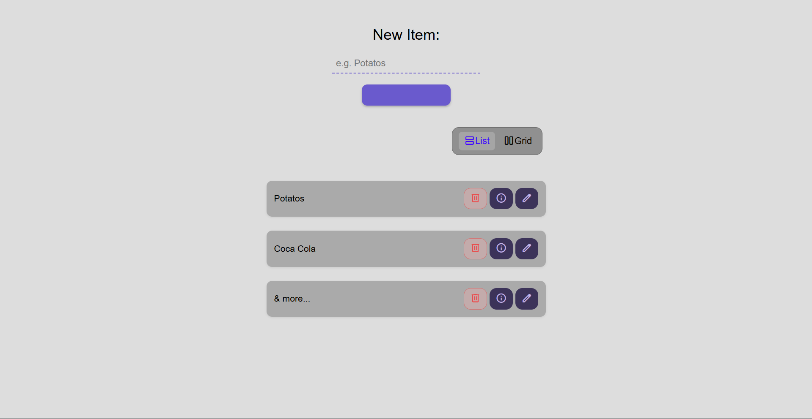
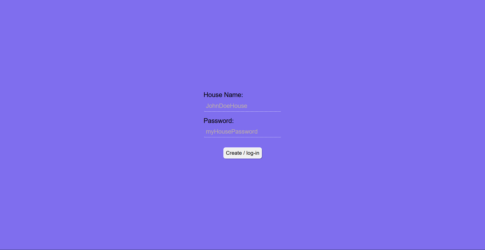
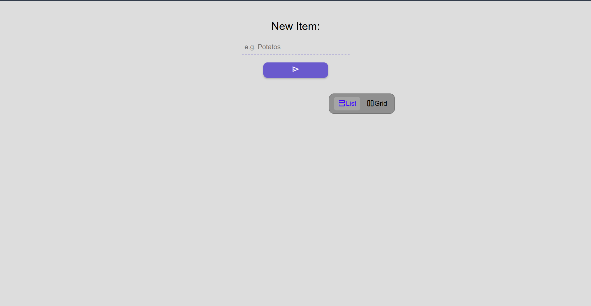
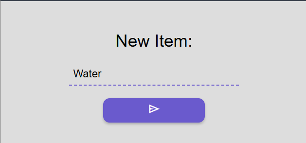
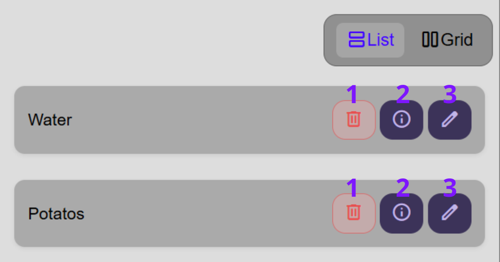

# Shopping List

**Shopping List** it's a website that helps you save your shopping list online!

You can use this [Here](https://brundevcoder.github.io/shopping-list/)

## How does it work?

Well... It all starts on a login screen, this might seem a bit confusing but it works like this: The code takes the house name and password to check in the DataBase (FireBase) if a path already exists, if it does, it  retrieves the data and displays it, othwise, it creates one.
As you can see, you have buttons to add new items to the list, as well as to remove them.

## How to actually use it?

First, it all starts with a login screen like this:

All you need to do is enter two pieces of information to create/log into an account! The **House Name** & **password**

A common question about this: Yes, it's entirely possible to create an account with same home username and a different password, try to think of the password as an ID

After you create/log into an account, you will see this page:

At the top of the page, you'll find where you create items for the list!

After writing your item, simply click the submit button and you're done!
Once you create items, you will encounter 3 different buttons for each one:

1. The delete button, well... It simply removes your item from the list.
2. The Info button simply shows the date and time it was created
3. The edit button allows you to modify the item's name

## What problems does it solve?

Has it ever happened to you that a relative asked you to take a picture of their shopping list and you were busy? Or maybe you forgot to add something to the list? Using **Shopping List** makes everything much easier!